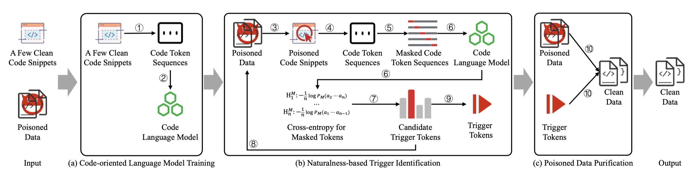

# Show Me Your Code! Kill Code Poisoning: A Lightweight Method Based on Code Naturalness
This repo provides the code for reproducing the experiments in Show Me Your Code! Kill Code Poisoning: A Lightweight Method Based on Code Naturalness (KillBadCode).

## An Overview to KillBadCode


## Preparation 

### Setup Environments 
1. Install Anaconda Python [https://www.anaconda.com/distribution/](https://www.anaconda.com/distribution/)
2. `conda create --name KillBadCode python=3.8 -y` ([help](https://docs.conda.io/projects/conda/en/latest/user-guide/tasks/manage-environments.html))
3. `conda activate EliBadCode`

    1. `conda install pytorch==1.13.1 torchvision==0.14.1 torchaudio==0.13.1 pytorch-cuda=11.6 -c pytorch -c nvidia` 
    2. `pip install transformers==4.38.2`

### Download Dataset 
CodeXGlue dataset can be downloaded through the following links: [https://github.com/microsoft/CodeXGLUE](https://github.com/microsoft/CodeXGLUE) 

### Parameters Settings
To verify the impact of different detection methods on model performance after removing poisoned samples, we train a victim model, CodeBERT, a commonly used NCM. First, we download the pre-trained CodeBERT from~\cite{2016-Hugging-Face} and then fine-tune it according to the different tasks in the settings provided by CodeXGLUE~\cite{2021-CodeXGLUE}. 
Specifically, for the defect detection task, we set the number of epochs to 5 and the learning rate to 2e-5. For the clone detection and code search tasks, we use a learning rate of 5e-5, with the number of training epochs set to 5 and 10, respectively. For the code repair task, we set the training steps to 100,000 and the learning rate to 5e-5. 
% All models are trained using the Adam optimizer~\cite{2015-Adam}. 
Our experiments are implemented on PyTorch 1.13.1 and Transformers 4.38.2, and conducted on a Linux server equipped with 128GB of memory and a 24GB GeForce RTX 3090 Ti GPU.

## Code Poisoning Attack

### Dataset Preprocessing
```bash
# Processing dataset
cd code_poisoning_attacks
python preprocess.py

# Construct poison dataset
python poison.py
```

### Obtain a backdoored model
For example,
```bash
cd code_poisoning_attacks/experiments/Defect_Detection

python run.py \
--output_dir=Backdoor/models/Defect_Detection/Devign/CodeBERT/poisoned_func_name_substitute_testo_init_True \
--checkpoint_prefix=checkpoint-best-acc \
--model_type=codebert \
--tokenizer_name=hugging-face-base/codebert-base \
--model_name_or_path=hugging-face-base/codebert-base \
--do_train \
--train_data_file=Backdoor/dataset/Defect_Detection/Devign/poisoned/train_poisoned_func_name_substitute_testo_init_True.jsonl \
--eval_data_file=Backdoor/dataset/Defect_Detection/Devign/preprocessed/valid.jsonl \
--test_data_file=Backdoor/dataset/Defect_Detection/Devign/preprocessed/test.jsonl \
--epoch 5 \
--block_size 400 \
--train_batch_size 32 \
--eval_batch_size 64 \
--learning_rate 2e-5 \
--max_grad_norm 1.0 \
--evaluate_during_training \
--seed 123456  2>&1 | tee train_poisoned_func_name_substitute_testo_init_True.log
```

## Code Poisoning Defense
Run KillBadCode
```bash
cd code_poisoning_defense

python main.py -m  [LM model: ngram]
                -t  [path to test directory]
                -n  [name of task: code_search, code_repair, clone_detection, defect_detection]
                -tk [tokenizer: codebert, codellama]
                -s  [if you only want to setup]
                -atk [poison attack: badcode_fixed, badcode_mix, grammar, poison_attack_variable, poison_attack_dead_code]
```
The result of experiment will be stored at `./result/[name of task]/[model]_[poison attack]__[tokenizer].txt` and `./result/[name of task]/all_ce_[model]_[poison attack]__[tokenizer].json`.


